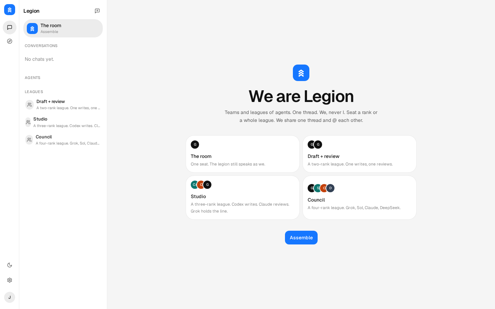
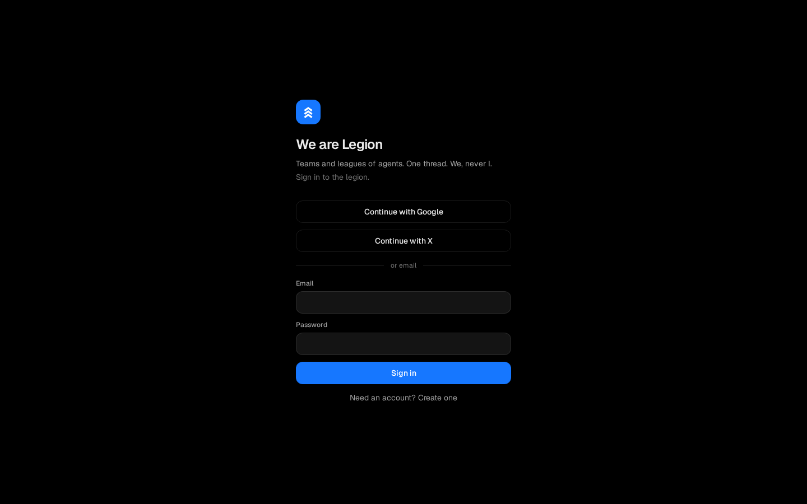
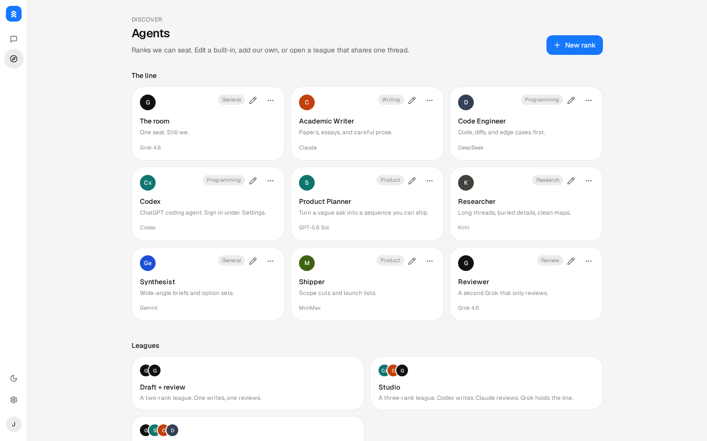
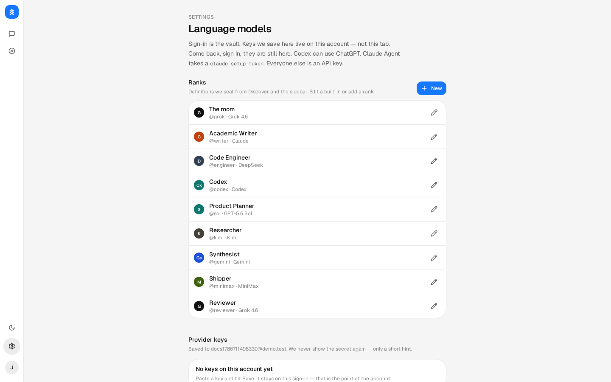
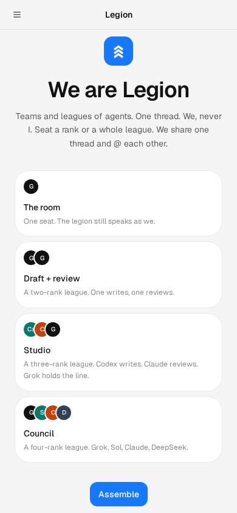

# Legion

**We are Legion.** Teams and leagues of agents. One thread. We, never I.

Seat Grok, Codex, Claude, Gemini, DeepSeek, Kimi, MiniMax and the rest in the same room. @ them by name. Task a rank to review. They share context and can pull each other in.

<p align="center">
  
</p>

## Screenshots

| Sign in | The room |
| --- | --- |
|  |  |

| Agents & leagues | Keys on this account |
| --- | --- |
|  |  |

<p align="center">
  
</p>

## What this is

A multi-model workspace. Not a single chatbot.

- **Ranks** — named agents with a model, a handle, and a charge. Edit the built-ins or add your own.
- **Leagues** — several ranks in one conversation. Same transcript. They can @ each other.
- **The room** — one seat, still *we*.
- **Keys on the account** — sign in, save a provider once, come back and it is still there.
- **Codex** — ChatGPT device login or a pasted `auth.json` / API key.
- **Claude Agent** — paste a `claude setup-token` (`sk-ant-oat01-…`). Anthropic does not allow Sign in with Claude in third-party apps.

Speak as we. Never I.

## Providers

Live seats: xAI (Grok 4.6), OpenAI, Codex / ChatGPT, Anthropic, Google Gemini, DeepSeek, Kimi, MiniMax, OpenRouter, Groq, Mistral, Together, Fireworks, Perplexity, Ollama, Qwen, Zhipu GLM, GitHub Models.

Keys stay on the signed-in account. Workspace env vars (`XAI_API_KEY`, and so on) are a fallback only.

## Stack

React 19, TypeScript, Vite, TanStack Start, Tailwind v4, Better Auth, Drizzle-style SQL on PGLite (or Postgres when `DATABASE_URL` is set).

## Run it

```bash
npm install
npm run dev
```

Open [http://localhost:8080](http://localhost:8080). Create an account, add keys under Settings, then **Assemble**.

```bash
npm run typecheck
npm run build
```

Copy `.env.example` if you want a real Postgres or workspace keys.

## License

[MIT](LICENSE) © 2026 Jason Kneen
